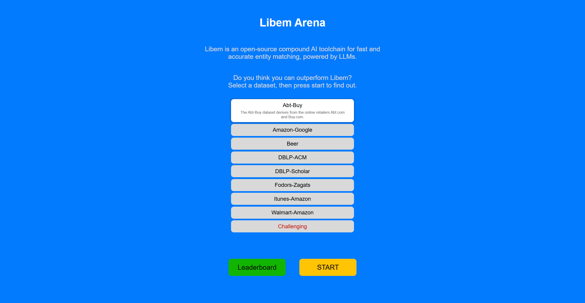
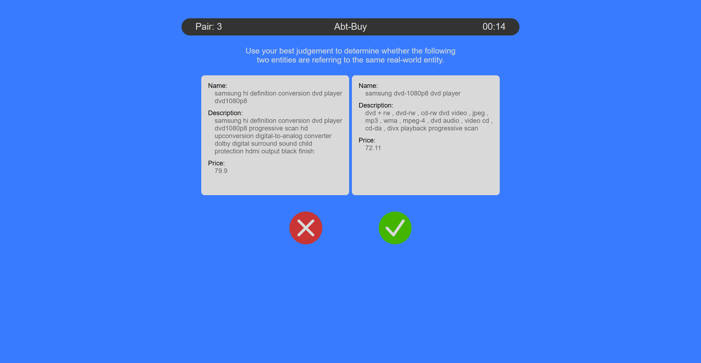
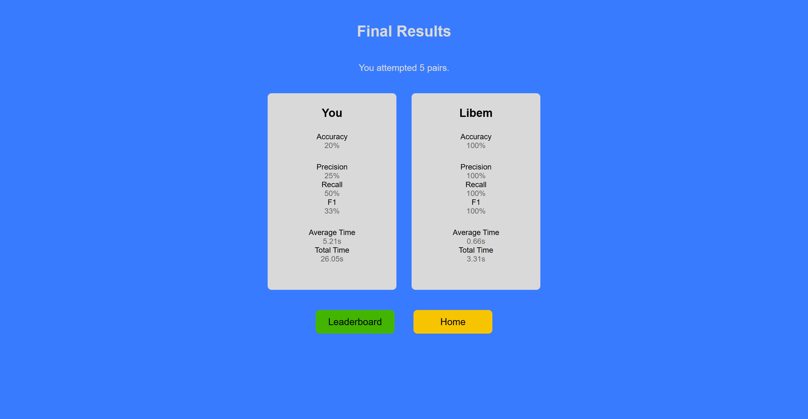
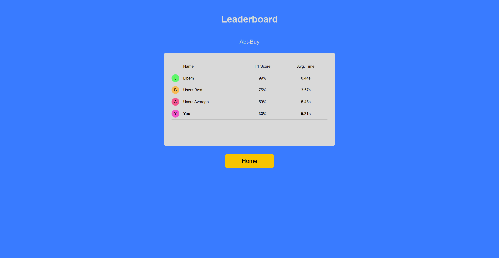

# Libem Arena

Libem-arena is a simple web "game" which allows crowd-sourcing entity matching over a web page.

Two entities are given, and the user has to decide if they are the same or not by clicking yes or no button.
- Pairs of entities are sampled from the datasets on different categories
- User selections are logged anonymously using a session UUID
- User performance is compared to Libem and aggregate stats of all other users

## Set up

Libem arena is available to try out at https://arena.libem.org.

To host your own version: 

#### Backend

The backend is self-contanined in `./serve.py`, and can be hosted using uvicorn by running

```
libem/arena> python serve.py
```

#### Frontend

The frontend can be compiled into static HTML in `./dist` by running

```
libem/arena> npm i # installs all dependencies
libem/arena> npm run build
```

## Screenshots




